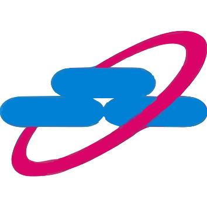

# Dashboard Distribusi — Sumatera & Kalbar

Dashboard performa distribusi semen, terhubung langsung (live) ke Supabase. Multi-page, tanpa framework/build step — HTML, CSS, JS biasa, jadi bisa langsung dibuka atau di-deploy ke mana saja.

## Struktur folder

```
project/
├─ index.html              ← halaman utama, memuat semua file di bawah
├─ css/
│  └─ style.css             ← semua styling (design tokens, layout, komponen)
├─ js/
│  ├─ config.js              ← URL & API key Supabase, konstanta global
│  ├─ data.js                ← fetch helper + daftar sumber data (views Supabase)
│  ├─ utils.js                ← format angka/tanggal, badge capaian, Chart.js defaults, animasi
│  ├─ router.js               ← navigasi antar halaman (hash routing)
│  └─ pages/
│     ├─ beranda.js
│     ├─ performa-daerah.js
│     ├─ distributor.js
│     ├─ tim-sales.js
│     └─ peta-toko.js
└─ vendor/                  ← Chart.js & Leaflet, disalin lokal (BUKAN dari CDN)
   ├─ chart.umd.js
   ├─ leaflet.js / leaflet.css
   ├─ leaflet.markercluster.js
   └─ MarkerCluster*.css
```

Library divendor lokal (bukan link ke `cdnjs.cloudflare.com`, dsb) supaya dashboard tetap jalan meskipun jaringan kantor memblokir CDN eksternal — satu-satunya koneksi keluar yang dibutuhkan adalah ke Supabase.

## Cara menjalankan

**Paling simpel:** double-click `index.html`, langsung terbuka di browser dan mengambil data live dari Supabase.

**Direkomendasikan (supaya semua fitur browser jalan normal):** jalankan local server dari dalam folder `project/`:

```bash
python -m http.server 8000
# lalu buka http://localhost:8000
```

atau kalau ada Node.js:

```bash
npx serve .
```

## Deploy supaya bisa diakses tim (online)

Drag-and-drop seluruh folder `project/` ke salah satu:
- **Netlify Drop** — netlify.com/drop
- **Vercel** — vercel.com (import folder / drag-drop)
- **GitHub Pages** — push folder ini ke repo, aktifkan Pages di Settings

Dalam hitungan detik dapat link publik yang bisa dibagikan ke tim.

## Tentang API key Supabase

Key yang dipakai (`sb_publishable_...`) adalah **publishable/anon key** — memang didesain untuk ditempel di kode sisi client seperti ini, dan aman selama Row Level Security (RLS) di Supabase sudah diatur dengan benar (sudah dikonfigurasi: hanya akses baca/`SELECT`, tidak bisa insert/update/delete). Jangan pernah pakai `service_role key` di file yang bisa diakses publik seperti ini.

## Sumber data (Supabase views)

Dashboard ini membaca dari beberapa **view** yang dibuat khusus di database (bukan query mentah ke tabel besar), supaya perhitungan berat dikerjakan oleh Postgres, bukan browser:

| View | Dipakai di halaman | Isi |
|---|---|---|
| `v_cement_targets_ext` | Performa Daerah | Target vs realisasi DO & Toko Aktif per region/distributor/bulan |
| `v_transaksi_monthly` | Beranda, Distributor | Agregat bulanan per distributor & produk |
| `v_yearly_totals` / `v_monthly_totals` | Beranda | Total tahunan/bulanan (aman untuk KPI, tidak double count) |
| `v_distributor_summary` | Distributor | Profil + realisasi tiap distributor |
| `v_salesman_performance` | Tim Sales | Target vs realisasi tiap salesman per bulan |
| `v_toko_agg` | Peta Toko | Data toko + agregat transaksi per toko |

Kalau butuh view baru atau field tambahan, bisa diminta lagi — tinggal sebutkan halaman/metrik yang mau diubah.

## Catatan asumsi

Kolom **"TA"** pada `cement_targets` & `salesman_status_target` diasumsikan berarti **"Toko Aktif"** (jumlah outlet aktif), berdasarkan pola nilainya — bukan nilai rupiah. Kalau ternyata singkatan lain, beri tahu supaya label di dashboard disesuaikan.

## Riwayat perubahan penting

- **Perhitungan tonase diperbaiki.** Semula dashboard memakai kolom `total_qty` mentah (satuan zak) sebagai "tonase". Sekarang dikonversi lewat fungsi database `calc_tonase(product_code, order_qty)`: dibagi 20 untuk `RJW003`/`CMT002`, dibagi 25 untuk `RJW004`/`CMT001`/`CWC001`. Kolom `order_qty`/`bonus_qty` tetap ditampilkan apa adanya dalam satuan zak.
- **Gaya visual dikembalikan ke tema industrial/blueprint** (hero dengan parallax + diagram jaringan distributor, palet oranye/biru, font Big Shoulders Display + IBM Plex). Font sekarang dibundel lokal (`vendor/fonts/`, dari paket `@fontsource`) — bukan lagi Google Fonts CDN — supaya tetap tampil benar meski jaringan memblokir CDN eksternal.
- Halaman **Distributor dihapus**; **Beranda** sekarang punya filter **Distributor** (khusus tag "Distributor", sub-distributor disembunyikan), **Jenis Semen**, dan toggle **MTD/YTD**; kartu Bonus Qty & Baris Transaksi diganti jadi **Toko Aktif** & **Cakupan Toko Aktif**; bagian "Distributor Teratas" diganti **Top Customer** (toko dengan tonase tertinggi) dengan pilihan Top 10/25/50.
- **Tim Sales**: kolom Target Tonase memakai **total target kuartal berjalan**, dan papan peringkat sekarang punya pilihan **Top 10/25/50**.
- **Peta Toko**: toko tanpa koordinat valid disaring dari peta (ditampilkan sebagai keterangan jumlah), filter per distributor tersedia.
- **Halaman baru: Rekap Harian.** Matriks tonase per tanggal &times; distributor untuk satu bulan (mengikuti format rekap harian yang biasa dipakai), lengkap dengan baris & kolom TOTAL, penanda hari Minggu, dan filter jenis semen. Filter bulan dibatasi mulai **Januari 2026** (data 2025 disembunyikan dari filter ini). Didukung fungsi database `dashboard_daily_matrix`.
- **Dua tabel tambahan di Rekap Harian**: *Rekap Mingguan* (tonase M1–M6 per distributor vs baris TARGET dari tabel `Target Dist`) dan *Rekap Mingguan vs Target* (capaian kumulatif tiap minggu, hijau jika capaian &ge; ambang pacing minggu itu). Ambang pacing dihitung **otomatis** dari proporsi hari kerja kumulatif (hari selain Minggu & tanggal merah nasional 2026 — cuti bersama tetap dihitung hari kerja sesuai arahan). Kedua tabel ini hanya terpengaruh filter bulan, tidak oleh filter jenis semen. Didukung view `v_target_dist` dan fungsi `weekBucketsForMonth`/`isWorkingDay` di `utils.js` (daftar hari libur nasional 2026 berdasarkan SKB 3 Menteri).
- Ditambahkan dua fungsi database (`dashboard_period_summary`, `dashboard_top_customers`) supaya semua angka (distinct DO, distinct toko aktif, ranking customer) tetap akurat untuk kombinasi filter distributor × periode × jenis semen apa pun — dihitung oleh Postgres, bukan disimpulkan dari data yang sudah diagregasi di browser.
- **Perbaikan skema setelah tabel `sales` dihapus.** View `v_distributor_summary` dan `v_salesman_performance` sempat ikut hilang (ter-cascade). Dibuat ulang: jumlah salesman per distributor sekarang dihitung dari `salesman_status_target` (distinct `salesman_code`), bukan lagi dari tabel `sales` yang sudah tidak ada. Semua data terkait sales memang sepenuhnya dari `salesman_status_target`.
- **Performa Daerah**: tabel "Rincian per Region" diganti jadi **"Rincian per Bulan"** (baris = Jan–Des 2026), kolom & filter lain tidak berubah.
- **Rekap Harian**: selain hari Minggu, **tanggal merah nasional 2026** (bukan cuti bersama) sekarang juga ditandai merah di tabel matriks harian.
- **Tim Sales**: Papan Peringkat sekarang di-sort default berdasarkan **Sales Rank** — rata-rata (Capaian TA % + Capaian Tonase %) — dari terbesar ke terkecil, kolomnya ditambahkan ke tabel dan grafik "Salesman Teratas" ikut memakai metrik ini.
- **Performa Daerah**: tabel "Rincian per Bulan" — label baris tidak lagi menampilkan "2026", dan kolom **DO 2026** dipindah ke antara Capaian DO dan YoY vs 2025.
- **Beranda**: ditambahkan grafik **Tren Tonase Aktual vs Target** (target dari tabel `Target Dist`, bukan `cement_targets` — selalu tonase penuh, tidak terpengaruh filter jenis semen) dan donut **Delivery Type**. Kedua donut (Bauran Produk & Delivery Type) sekarang menampilkan persentase rapi di legend & tooltip. Didukung fungsi database `dashboard_delivery_type_breakdown`.


- **Peta Toko**: berhenti pakai *clustering* — semua titik ditampilkan langsung (canvas renderer, tetap ringan untuk ±8.000 toko) supaya sebaran asli terlihat, bukan digantikan angka gerombolan. Warna diganti **hijau = aktif, merah = nonaktif**. `leaflet.markercluster` dilepas dari proyek (tidak dipakai lagi).
- **Halaman baru: Tanya AI.** Chat tanya-jawab bahasa natural tentang data dashboard (toko, penjualan, salesman, target), pakai **Groq** (API gratis, model `llama-3.1-8b-instant`) sebagai lapisan bahasa — semua perhitungan angka tetap dikerjakan Postgres lewat 3 fungsi baru (`ai_store_mom_change`, `ai_store_consistency`, `ai_salesman_ranking`) plus fungsi yang sudah ada, supaya AI tidak pernah mengarang angka. Detail arsitektur & pertimbangan keamanan ada di bagian "Tentang fitur Tanya AI" di bawah.

## Tentang fitur Tanya AI

**Kenapa Groq?** Setelah dibandingkan dengan beberapa opsi gratis (Google Gemini API, OpenRouter model `:free`, model kecil yang jalan di browser lewat WebGPU/WebLLM), Groq dipilih karena: gratis tanpa kartu kredit, API-nya kompatibel format OpenAI (gampang diintegrasikan lewat `fetch` biasa, tanpa SDK/library tambahan — jadi web tetap ringan), sangat cepat, dan model `llama-3.1-8b-instant` cukup untuk tugasnya karena **model TIDAK disuruh menghitung angka sendiri** — semua agregasi/statistik (rata-rata, persentase perubahan, ranking) dihitung oleh fungsi Postgres, model cuma bertugas (1) menerjemahkan pertanyaan bahasa natural jadi parameter query, dan (2) menulis ulang hasil angka itu jadi kalimat. Ini juga yang bikin jawabannya tidak mengarang data — angka yang tampil di tabel mini selalu diambil langsung dari hasil query, bukan dari teks yang ditulis model.

Alternatif model kecil yang jalan sepenuhnya di browser (WebLLM/Transformers.js) sengaja **tidak** dipakai karena harus mengunduh model (ratusan MB–beberapa GB) di setiap perangkat pengguna saat pertama kali buka, jauh lebih berat dibanding memanggil API — bertentangan dengan tujuan "tetap ringan".

**Catatan jujur soal "gratis unlimited":** tidak ada API gratis yang benar-benar tanpa batas — Groq punya kuota harian/menit yang cukup longgar untuk pemakaian tim internal, tapi bukan tak terbatas. Kalau kena limit, akan muncul pesan yang jelas di chat (bukan error membingungkan).

**Catatan keamanan API key:** karena situs ini murni file statis (tanpa server backend), API key Groq disimpan di `localStorage` browser dan dipakai langsung dari sana — **setiap pengguna mendaftar & memasukkan key gratis miliknya sendiri**, key ini TIDAK ditanam di kode yang dibagikan. Ini artinya key tsb bisa dilihat siapapun yang membuka DevTools di browser yang sama. Untuk pemakaian internal tim yang saling percaya, ini risikonya rendah (tidak ada biaya karena gratis, paling buruk kuota habis). Kalau nanti situs ini di-deploy publik/dibagikan ke orang luar, sebaiknya key dipindah ke proxy server kecil (misal Cloudflare Worker gratis) supaya key tidak pernah sampai ke browser pengguna — tinggal bilang kalau butuh bantuan setup itu.
- **Redesign total ke dark mode.** Sistem visual diganti sepenuhnya: latar charcoal gelap (bukan hitam pekat), aksen lime/chartreuse sebagai identitas utama, warna sekunder slate/gray-blue, tipografi Big Shoulders Display (judul besar, condensed) + IBM Plex Sans (UI) + IBM Plex Mono (label/data), border tipis kontras rendah untuk divider, tanpa shadow berat/gradient/glassmorphism/parallax. Nav sidebar dikelompokkan per kategori (Ringkasan, Performa, Operasional, Intelligence) dengan indikator aktif lime. Setiap halaman punya pola header konsisten: breadcrumb kecil, judul besar, deskripsi, filter periode, dan status data — lewat helper `pageHeader()` di `utils.js`.
- **Aksesibilitas**: semua kontrol chip/toggle diganti dari `<span>` jadi `<button>` asli (bisa dioperasikan keyboard), semua `<label>` dipasangkan lewat `for`/`id` ke inputnya, ikon dekoratif diberi `aria-hidden`, tabel sortable bisa diakses lewat keyboard (Enter/Space) dengan `aria-sort`, chart diberi ringkasan teks tersembunyi untuk screen reader, dan warna teks/border disesuaikan supaya lolos kontras minimum WCAG AA (label kecil ≥4.5:1, border interaktif ≥3:1 — sudah dihitung & diverifikasi manual).
- **Warna dikembalikan ke identitas oranye/biru** (skema sebelum redesign lime) — struktur/format dark mode, grouping nav, pageHeader, dan semua perbaikan aksesibilitas dari redesign sebelumnya tetap dipertahankan. Warna semantik (hijau/kuning/merah untuk status capaian) disesuaikan sedikit dari versi aslinya supaya tetap lolos kontras WCAG AA di atas background gelap (sudah dihitung ulang & diverifikasi). Peta Toko tetap pakai hijau=aktif/merah=nonaktif secara eksplisit (tidak ikut berubah jadi oranye).
- **Kembali ke tema terang industrial/blueprint** (hero dengan parallax + diagram jaringan distributor di Beranda, kartu dengan aksen garis oranye di atas, chip berbentuk pill, tekstur grain halus) — ini gaya yang paling disukai setelah dibandingkan dengan versi Qt-flat dan dua percobaan dark-mode. Semua fitur & perbaikan yang dibangun setelah gaya ini (Rekap Harian, Rekap Mingguan vs Target, filter jenis semen, Top Customer, halaman Tanya AI, breadcrumb, badge, perbaikan aksesibilitas) tetap dipertahankan — hanya palet & mood visualnya yang disesuaikan kembali. Tanya AI tetap tampil sebagai panel gelap (konsol analitik) di dalam aplikasi yang terang, seperti sebelumnya.
- **Bug fix kritis: halaman stuck di "Memuat…" dan tidak pernah tampil.** Penyebabnya `REDUCED_MOTION` dideklarasikan dua kali (`const`) di `js/config.js` dan `js/utils.js`. Karena semua file JS di sini adalah `<script>` biasa (bukan ES module), mereka berbagi satu scope global yang sama persis seperti file digabung jadi satu — deklarasi `const` ganda dengan nama sama di scope global itu SyntaxError fatal di browser (walau lolos cek sintaks per-file). Ini membuat seluruh isi `utils.js` gagal ter-load, sehingga hampir semua fungsi (termasuk yang dipanggil saat halaman render) hilang, dan spinner loading tidak pernah diganti. Sudah diperbaiki (deklarasi ganda dihapus), dan divalidasi ulang dengan menggabungkan seluruh file JS jadi satu lalu dicek — tidak ada lagi bentrok deklarasi lintas file.
- **Halaman baru: Delivery.** Dibangun murni dari tabel `delivery` (tidak dikaitkan ke tabel manapun — persis seperti `cement_targets` untuk Performa Daerah). Filter Region, Sub Region, Tipe Semen; KPI realisasi/target/pertumbuhan; grafik & tabel rincian per bulan.
- Tulisan "Sumatera & Kalbar" di sidebar dirapikan jadi "Sumatera · Kalbar" (pemisah titik tengah, konsisten dengan gaya label lain di seluruh dashboard) dan diberi `white-space:nowrap` supaya tidak terpotong.
- **Drill-down transaksi dari Rekap Harian.** Klik tanggal (misal "01-Agu") untuk lihat semua transaksi hari itu (semua distributor), atau klik angka tonase di sel tertentu (misal BKP = 43) untuk lihat transaksi hari itu khusus distributor tersebut — otomatis ikut filter Jenis Semen yang aktif. Membuka halaman baru "Detail Transaksi" (bukan bagian dari nav utama, hanya bisa diakses lewat klik dari Rekap Harian) yang menampilkan tabel mentah: tanggal, distributor, toko, produk, qty, tonase, no DO. Query-nya sangat ringan (query per hari+distributor rata-rata cuma 10-20 baris dari total 118 ribu baris transaksi) lewat view baru `v_transaksi_detail`.
- Kolom **Sales** ditambahkan ke halaman Detail Transaksi (nama salesman dari `salesman_status_target`, digabung lewat view `v_transaksi_detail` yang sudah diperbarui — tetap tanpa mengubah sumber data lain).
- **Tim Sales: Target Tonase & Capaian dikembalikan ke basis per bulan** (bukan kumulatif per kuartal seperti sebelumnya). Target TA, Target Tonase, dan Capaian sekarang murni membandingkan bulan yang dipilih terhadap target bulan itu saja.
- **Konfirmasi TA Aktual & Tonase Aktual sudah per bulan** (dicek langsung dari definisi `v_salesman_performance`: `EXTRACT(month FROM do_date)` di-join ke kolom `Month` target — bukan kuartal, tidak pernah salah di sisi ini; yang sempat salah sebelumnya hanya sisi Target, sudah diperbaiki di update sebelumnya).
- **Bersih-bersih "AI slop" di semua teks aplikasi.** Diriset dulu pola-pola ciri tulisan AI generik (overuse em dash untuk menyambung klausa, kosakata generik seperti "robust"/"seamless", hedging yang tidak commit, struktur simetris "bukan cuma X tapi Y"), lalu diaudit ke seluruh isi web: semua kalimat yang disambung pakai tanda pisah (—) ditulis ulang jadi kalimat terpisah/direstrukturisasi (bukan cuma ganti tanda baca), termasuk pesan error, teks interpretasi di Tanya AI, dan komentar kode. Sudah dicek juga tidak ada buzzword generik atau kata-kata hedging berlebihan di teks manapun.
- **Drill-down transaksi dari Tim Sales.** Di Papan Peringkat, klik nama salesman untuk lihat semua transaksi salesman itu di bulan yang sedang difilter. Membuka halaman "Detail Transaksi" yang sama seperti drill-down dari Rekap Harian, sekarang mendukung dua mode: tanggal+distributor (dari Rekap Harian) dan salesman+bulan penuh (dari Tim Sales), dengan tombol kembali yang menyesuaikan ke halaman asalnya.
- **Performa Daerah, grafik "Toko Aktif per Bulan"**: saat filter Tipe Semen = Semua Tipe, pakai kolom `ta_distinct_2026` (+ garis Target). Saat tipe spesifik dipilih (RJW/STR/WC), otomatis pindah ke kolom `ta_2026` dan garis Target disembunyikan (tidak relevan per-tipe). Dikonfirmasi lewat data: `ta_distinct_2026` cuma terisi di baris STR (0 di baris lain) sehingga sum-nya otomatis jadi angka distinct yang benar untuk kasus "semua tipe" digabung.

## Cara mengganti logo perusahaan

Ada slot logo di bagian atas sidebar (di atas tulisan "DISTRIBUSI DASHBOARD"), sekarang masih diisi placeholder bertuliskan "GANTI FILE INI".

**Lokasi file:** `project/assets/logo.svg`

**Cara ganti:**
1. Siapkan file logo perusahaan kamu (format SVG paling bagus karena tajam di semua ukuran layar; PNG/JPG juga bisa).
2. **Cara termudah** — kalau logonya SVG, langsung timpa file `assets/logo.svg` dengan filenya (nama file harus sama persis: `logo.svg`). Tidak perlu ubah kode apapun.
3. **Kalau logonya PNG/JPG** — simpan file di folder `assets/` (misal `assets/logo.png`), lalu buka `index.html`, cari baris:
   ```html
   
   ```
   Ganti `assets/logo.svg` jadi `assets/logo.png` (sesuaikan dengan nama file kamu).

Ukuran logo otomatis menyesuaikan lebar sidebar (maksimal tinggi 44px), jadi tidak perlu resize manual — logo landscape maupun persegi sama-sama akan pas. Kalau file logonya belum ada/rusak, gambarnya otomatis disembunyikan (tidak muncul ikon "gambar rusak") dan tulisan "DISTRIBUSI DASHBOARD" tetap tampil normal di bawahnya.
- **Logo perusahaan dipasang** di `assets/logo.svg` (file asli yang dikirim, bukan placeholder lagi), ditampilkan sebagai ikon persegi (42×42px) sejajar teks "DASHBOARD SEMEN" di sidebar — bukan ditumpuk di atas teks seperti sebelumnya, supaya proporsinya pas untuk logo berbentuk ikon/lambang (bukan logo landscape).
- **Hero Beranda didesain ulang jadi data-driven.** Judul besar sekarang menampilkan kode distributor dengan tonase tertinggi bulan berjalan (bukan tagline statis), dilengkapi panel "Top 5 Tonase" di sampingnya yang menampilkan ranking distributor lengkap dengan angkanya — komponen baru khusus untuk menampilkan data peringkat, bukan sekadar teks. Data ini selalu berdasarkan bulan berjalan sesungguhnya, tidak terpengaruh filter distributor/jenis semen/periode di bawahnya (supaya jadi spotlight yang stabil, bukan angka yang berubah-ubah saat orang lain sedang mengeksplorasi filter).
